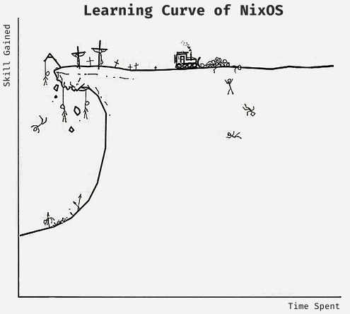

  

# About

My [Nix](https://nixos.org/learn.html) and [Home-Manager](https://github.com/nix-community/home-manager) configuration for [NixOS](https://nixos.org) based systems.

> [!NOTE]  
> This repository is not meant to be used as a whole, but rather as a reference for my own configuration. I do not recommend using it as is, as it is not meant to be used by anyone else. I do not provide any support for this repository. If you want to use it, you are on your own.

> [!IMPORTANT]
> I'll eventually switch to [flakes](https://wiki.nixos.org/wiki/Flakes) and [hive](https://github.com/divnix/hive) (or [flake-parts](https://github.com/hercules-ci/flake-parts) + [haumea](https://github.com/nix-community/haumea) | [omnibus](https://github.com/tao3k/omnibus)) configuration.

> [!CAUTION]
> ~~Although [nixos.wiki](https://nixos.wiki) has been mentioned and referenced in many places in this repository, it is not an official documentation, it's user maintained. It's *not recommended* to use the unofficial wiki, instead use the official wiki. The unofficial wiki is not up-to-date, poorly maintained and may contain incorrect information.~~ Replaced all references to the unofficial wiki with the official wiki. However, some references might be dead, so you may still need to visit the unofficial wiki or other.
>
> The **official** documentation is available at [wiki.nixos.org](https://wiki.nixos.org).

## Formatter and Linter

**[alejandra](https://github.com/kamadorueda/alejandra)** is used to format all the nix files. nixfmt and nixpkgs-fmt both advertise ugly and confusing diffs. It is based on the original style of Nixpkgs, and then they applied the feedback from developers with extensive experience using Nix at scale, producing a very well-grounded style guide.

**[statix](https://github.com/nerdypepper/statix)** is used to capture and fix anti-patterns in all the nix files.

**[deadnix](https://github.com/astro/deadnix)** is used to scan nix files for dead code and automatically remove unused code.

<h2 align="center">
  Abandon Hope, All Ye Who Enter Here
</h2>

  

## Proudly

